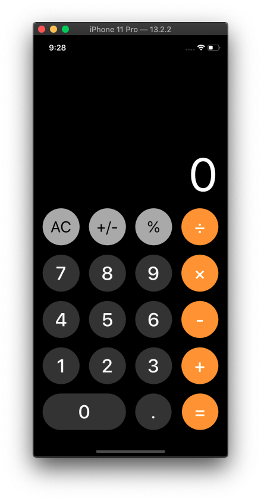

# iCalculator

**`¡HOLA MUNDO! 👋🏼`**

## Descripción
App replica de calculadora que hay en iphone 

## Requisitos
* [Xcode](https://developer.apple.com/xcode/) 11.2.1
* Swift 5.2
* iOS 10.x o superior (Compatible con iPhone y iPad)

## Encuéntrame en:

### Autor
*Abel Lázaro. © 2019-2020*
